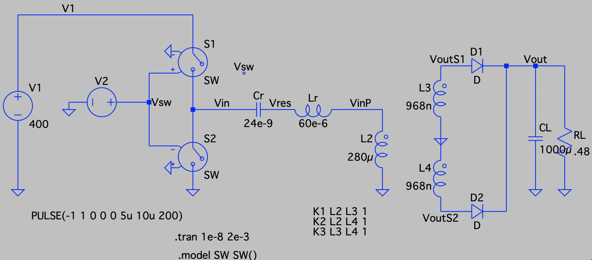

# ML scripts

The machine learining code is based on the ray[rllib]. The ray[rllib] interact with open AI Gym library. Gyn provides custome environment. The custome environment has to have the following interfaces:  

## reset()
>
> reset the environment. return the observation of the environment.

## step(action)
>
> run the environment according to the action. return the observation, reward, terminated, and an optional information.

This project uses half bridge llc converter as an example. The circuit is shown below:  



In this demo, the design target is to reach the required output voltage with minimum RMS current on $L_r$. The tunable values in the demo are $L_r$ and $C_r$. Hence, the observation space is $[L_r, C_r, V_{out}^*, V_{out}, I_{rms}]$; The action space is a vector of two flags. The flag has three value $[0, 1, 2]$, '0' means decrease value; '1' means keep the value; '2' means increase the value.  
Since in circuit, the comertial available value of inductor or capacitor are not linear. Therefore, it is exponetially mapped to 0~1.

# Netlist syntax

The MNA.py creates hardware required matrixes and vectors from netlist. The syntax is similar to spice netlist. Here is the syntax:  

>## V* Node1 Node2 Value
>
> Add a voltage source to the circuit. The 'Node1' is positive and the 'Node2' is negative. The voltage value is 'Value'.

>## I* Node1 Node2 Value
>
> Add a current source to the circuit. The current flows from 'Node1' to 'Node2'. Value = 'Value'.

>## L* Node1 Node2 Value
>
> Add an inductor between 'Node1' and 'Node2'.

>## C* Node1 Node2 Value
>
> Add a capacitor between 'Node1' and 'Node2'.

>## R* Node1 Node2 Value
>
> Add an inductor between 'Node1' and 'Node2'.

>## D* Node1 Node2 Value
>
> Add a diode between 'Node1' and 'Node2'. The 'Node1' is anode. The voltage drop is 'Value'

>## S* Node1 Node2 Value
>
> Add a switch between 'Node1' and 'Node2'. A serial resistance must be specified with 'Value'.

>## E* Node1 Node2 Node3 Node4 Value
>
> Add a voltage control voltage source between 'Node1' and 'Node2'. The control signal is the voltage between 'Node3' and 'Node4', the gain is 'Value'

>## H* Node1 Node2 Vname Value
>
> Add a current control voltage source. The current flows from 'Node1' to 'Node2'. The control current is the current flowing into the volatge source 'Vname'

>## G* Node1 Node2 Node3 Node4 Value
>
> Add a voltage control current souce. The current flows from 'Node1' to 'Node2'. The control signal is the voltage between 'Node3' and 'Node4'.

>## F* Node1 Node2 Vname Value
>
> Add a current control current source. The current flows from 'Node1' to 'Node2'. The control current is the current flowing into the volatge source 'Vname'.

>## K* Lname1 Lname2 Value
>
> Couple two inductor. The coupled coefficient is 'Value' and two inductors names are 'Lname1' and 'Lname2'. This is used to build the transformer.

## The netlist for the example circuit is  

```
Vs Vs 0 400
S1 Vs Vin .1
S2 Vin 0 .1
Cr Vin Vcl 24n
Lr Vcl Vpp 70u
L1 Vpp 0 280u
L2 Vd1 0 968n
L3 0 Vd2 968n
D1 Vd1 Vtout 0
D2 Vd2 Vtout 0
Rds Vtout Vout .001
CL Vout 0 1000u
RL Vout 0 0.48
K1 L1 L2 1
K2 L2 L3 1
K3 L1 L3 1
```
