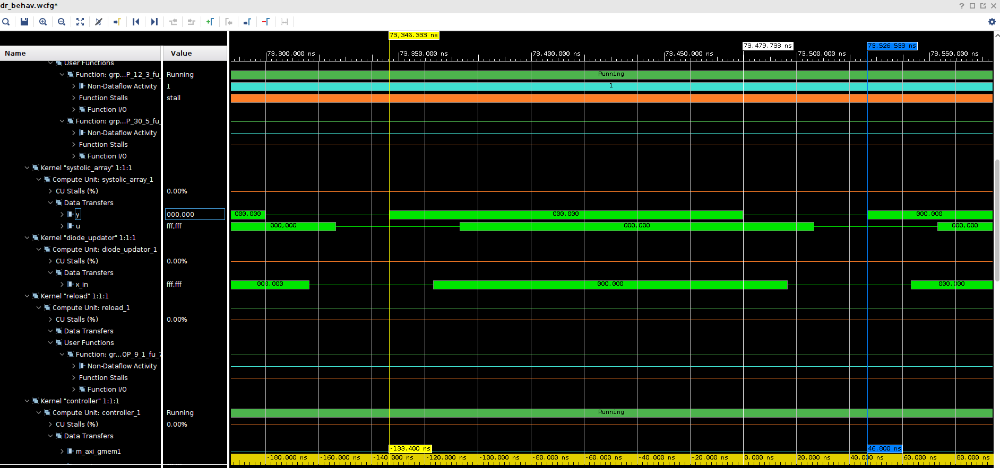

# vhls_spice

# Introduction

This is a vitis project that creates bit_container.xclbin for hardware acceleration of power electronics time domain simulation. It contains following folders:
> host_src  
>
> * Host sources to run Hardware emulation. Software emulation is not supported because free running kernels are used.
>
> kernel_src
>
> * Kernel sources contains c++ kernels and the linker file to connect the kernels.

To create the bit_container.xclbin, correct pathes should be set in the Makefile. Here is the example.

```makefile
# tool chain path
XILINX_VITIS ?= /tools/Xilinx/Vitis/2021.2
XILINX_XRT ?= /opt/xilinx/xrt
XILINX_VIVADO ?= /tools/Xilinx/Vivado/2021.2
XILINX_HLS_INCLUDES ?= /tools/Xilinx/Vitis_HLS/2021.2/include

# Platform path
VITIS_PLATFORM = xilinx_aws-vu9p-f1_shell-v04261818_201920_2
VITIS_PLATFORM_DIR = /home/Nextlab_Share/aws-fpga/Vitis/aws_platform/xilinx_aws-vu9p-f1_shell-v04261818_201920_2
VITIS_PLATFORM_PATH = $(VITIS_PLATFORM_DIR)/xilinx_aws-vu9p-f1_shell-v04261818_201920_2.xpfm
```

The default target is hardware emulation. To run, just type:

```shell  
make all -j8
```

To make xclbin that can be run on FPGA, specify the TARGET as hw:  

```shell
make all TARGET=hw -j8
```

# Time domain simulation algorithm

The time domain simulation is based on Modified Nodal Analysis (MNA) [^MNA]. MNA itself doesn't support simulate reactive components such as inductors and capcaitors in time domain at the begining. To solve the problem, the reactive componets are modeled as a resistor and a current source connected in parallel. The resistor in the model is constant during the time domain simulation while the current source changes depending on the circuit status from the previous time step. In general, MNA is solving the linear equation:  
$$
Ax=z
$$

or:
$$
\left[
\begin{array}{c|c}
G & A\\
\hline
B & C
\end{array}
\right]
\left[
\begin{array}{c}
V \\
\hline
I
\end{array}
\right]=\left[
\begin{array}{c}
j \\
\hline
v
\end{array}
\right]
$$
where $A$ depends on the circuit. $x$ is the cricuit status vector, with all nodal voltages included in $V$ and all current flowing into voltage sources in $I$ $z$ is the source vector, with all current flowing into the node from a current source included in $j$ and all voltage appied on specified order (same with the order in $I$ included in $v$ Hence, if $z$ and $A$ are known, $x$ can be solved by calculate $x=A^{-1}z$ $A$ must be inversiable because the circuit should always have a solution physically).  
As discussed before, for reactive components, the value of current source depends on the circuit status of the last time step, namely, $x^{n-1}$. Through adding extra auxilary components (such as zero voltage source, which won't change the operation of the original circuit), it can be assured that corresponding value of the current source can be calculated via $Hx^{n-1}$. Therefore, according to superposition theory, we can partion $z$ into two parts; part 1 $z_0$ that from the human provided sources, such as constant voltage supply; part 2 $z_{re}=Hx$ that from reactive components. Then, the iteration formula becomes:  
$$
    x^n = A^{-1}z = A^{-1}(z_0 + z_{re}) = A^{-1}z_0 + A^{-1}Hx^{n-1}
$$
In power electronics, all devices are mostly linearized including the diodes and CMOS switches. The switches (didoes and CMOS switches), has two status, ON and OFF. When the switch is on, it can be modeled as a small inductor; when it is off, it can be modeled as a small capacitor [^sw]. Via picking proper simulation time step, the status changing between ON and OFF can be simply realied by changing the value of the current source. In this case, $A$ is identical all the time. For each switch, two $H$ matrixes are required, one for on and one for off. Hence, if we use $sw[i]$ to represent the status of $i_{th}$ switch (0 for off, 1 for on), the iteration formula becomes:  
$$
x^n = A^{-1}z_0 + A^{-1}Hx^{n-1} + \sum_{i=0}^{N_S-1}sw[i]?A^{-1}H_i^{on}x^{n-1}:A^{-1}H_i^{off}x^{n-1}\\
$$
$N_S$: number of switches  
$b?A:B$ : returns $A$ if b is true (!0), otherwise, return $B$.  

For CMOS switches, its status is determined by external control signal. For diodes, its status follows the following formula:
$$
sw^{n}[i] = sw^{n-1}[i]?i_d>0:v_d>v_{th}
$$
To get the current follows into the diode and the volatge accross the diode, we can multiply the circuit status vector $x$ with a row vector $J$.  

All matrixes and $J$ are generated via a python script from the providing netlist.  

# System Diagram and Control

The system diagram is:

The "HOST" is PC. On FPGA domain, it has 11 interconnected modules. Six of them (red blocks) are connected to the HOST via M_AXI4 bus and these moduels requires the software to activate. The other modules are free-running kernels. The function of the kernels are shown below:  

## Controller (controller.cpp)
>
> Generate input of the Systolic Array. In the first iteration, it reads initial status of the circuit $x_0$ from the host and combine it with the source vector. In the following iterations, it receives the new status and send it back to Systolic Array.

## Systolic_Array (systolic_array.cpp)
>
> Systolic arrays to calculate matrix times vector. The matrix is reloadable. The module receive source vector and circuit status vector in serial and give out the results togerther in serial.

## Tree_adder (adder_tree.cpp)
>
> Sum up the results according to the switch control signal and diode status. It generates the new vector $x$.

## Stream_Divider (Stream_Divider.cpp)
>
> This module simply copy the data of input channel to three output channel. The main purpose is to reduce the loop lantency.

## Diode_updator (diode_updator.cpp)
>
> This module updates the diode status once a new $x$ is received. The diode status is streamed out to the Tree_Adder.

## Observer (observer.cpp)
>
> This module is to observe the result of all $x$. It is capable of measuring one mean value and one variance. With the observation, the entire waveform is not necessary, which can reduce the time costed to migrate data from FPGA to host.

## Switch_Generator (switch_controller.cpp)
>
> This module read switch control signal from the host and stream it to the Tree_Adder. The switch control period can be set so that only the switch signal in one control period is required to be generate through software.  

## Source_Generator (src_generator.cpp)
>
> This module read source vectors from the software and stream it to the controller. The source period can also be set. Period = 1 makes the system a DC input.

## Result_DMA (result_back.cpp)
>
> This module is a simple DMA module. It is seperated from the control module to reduce the logic inside the iteration loop.

## Reload_DMA (reload.cpp)
>
> This module read the matrixes and vectors from host DDR and send them via axi stream bus.

## Reload_DataPackager (reload_converter.cpp)
>
> Add user and last signal to the reload stream, and send them to systolic_array and diode_updator.

# Important Hardware kernels  

## Data type definitions

All global data type definitions are wrote in *typedef.hpp*. The hardware connot process floating point data efficiently, therefore, all data are transfered to a fixed point number when read from the host, and transfered back to corresponding software data type when they are writen back.  
The data transferred between free running kernels must use AXI stream interface. Xilinx officially supports AXI stream interface with side channels (*tlast*, *tuser*, ...). However, it some times gives some errors when using the AXI stream with side channels. Therefore, the side channels and data are packed in a structure, such as:  

``` c
typedef ap_fixed<W,IW> d_htype;
typedef ap_uint<1> logic;
typedef struct __attribute__((packed)){
    d_htype data;
    logic last;
    logic user;
}dp_htype;
```  

The *\_\_attribute\_\_((packed))* is to avoid wasting data width because C may automatically align to 32 bits or 4 bytes[^SoI].

## systolic_array

The systlic_array kernel contains NM (Number of Matrixes) of matrix multiplication processing units using systolic structure. PE0 calculates $A^{-1}z_0$; PE1 calculates $A^{-1}Hx^{n-1}$; the other PEs are in pair of two, each pair is responsible for one switch.

```
               ┌───────────────────────────────────────────────┐                
               │                                               │                
               │                                               │                
               │                ┌───────────────┐              │                
               │                │               │              │                
               │       ┌────────▶      PE3      ├─────────┐    │                
               │       │        │               │         │    │                
               │       │        └───────────────┘         │    │                
               │       │                                  │    │                
               │       │        ┌───────────────┐         │    │                
               │       │        │               │         │    │                
               │       ├────────▶      PE2      ├────────┐│    │                
               │       │        │               │        ││    │                
               │       │        └───────────────┘        ││    │                
               │       │                                 ││    │                
               │       │        ┌───────────────┐        ││    │                
               │       │        │               │        ││    ├────────────────
               │       ├────────▶      PE1      ├───────┐│└────┼─────▶          
               │       │        │               │       │└─────┼─────▶          
               │       │        └───────────────┘       └──────┼─────▶          
               │       │                                  ┌────┼─────▶          
  last_status  │       │        ┌───────────────┐         │    ├────────────────
  ─────────────┼───────┘        │               │         │    │                
  source       │                │      PE0      ├─────────┘    │                
  ─────────────┼────────────────▶               │              │                
               │                └───────────────┘              │                
               │                                               │                
               │                systolic_array                 │                
               └───────────────────────────────────────────────┘                
```

## adder_tree

The final circuit status is sum up of all valid results from the systolic_array (enabled by superposition). The swithes and diodes have two different status so it is required to pick between the pair of the results from systolic_array. The sum of all selected vectors produce the new circuit status vector $x$.

```shell

  │     │         │     │           │     │          
  │     │         │     │           │     │          
  │     │         │     │           │     │          
  │     │         │     │           │     │          
  │     │       ──▼─────▼──       ──▼─────▼──        
  │     │       ╲         ╱       ╲         ╱        
  │     │        ╲───┬───╱         ╲───┬───╱         
  │     │            │                 │        ...  
┌─▼─────▼─┐          │  ┌───────────┐  │             
│    +    │          └──▶     +     ◀──┘             
└────┬────┘             └─────┬─────┘                
     │                        │                      
     │      ┌─────────┐       │                 ...  
     └──────▶    +    ◀───────┘                      
            └────┬────┘                              
                 │                                   
                 ▼                                   
```

# Simulaion waveform

The wavefrom of the control module is shown below:  
  
The clock frequency in the simulation is 300MHz, the matrix dimention $M$ is 40. All the kernels included in the loop have II=1. Therefore, it takes 40 clocks to do the computation. The latency of the circuit is 14. Hence, it takes $M+14$ clocks to do one iteration. Therefore, the average II is $(M+14)/M$. The circuit is more efficient with larger $M$.

[^SoI]: <https://docs.xilinx.com/r/en-US/ug1399-vitis-hls/Structs-on-the-Interface>  

[^MNA]: <https://lpsa.swarthmore.edu/Systems/Electrical/mna/MNA1.html>  

[^sw]: Pejović, P., & Maksimović, D. (1994). A Method for Fast Time-Domain Simulation of Networks with Switches. IEEE Transactions on Power Electronics, 9(4), 449–456. <https://doi.org/10.1109/63.318904>
